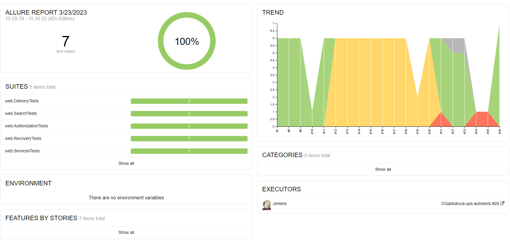
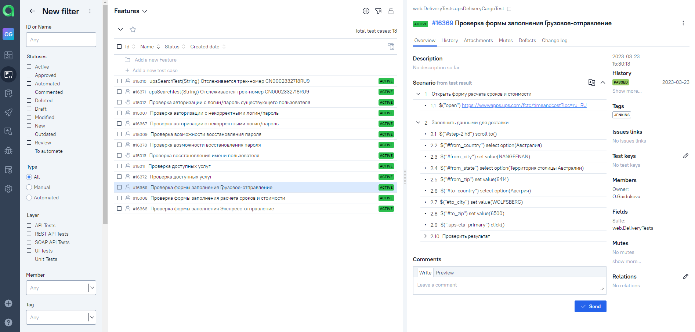
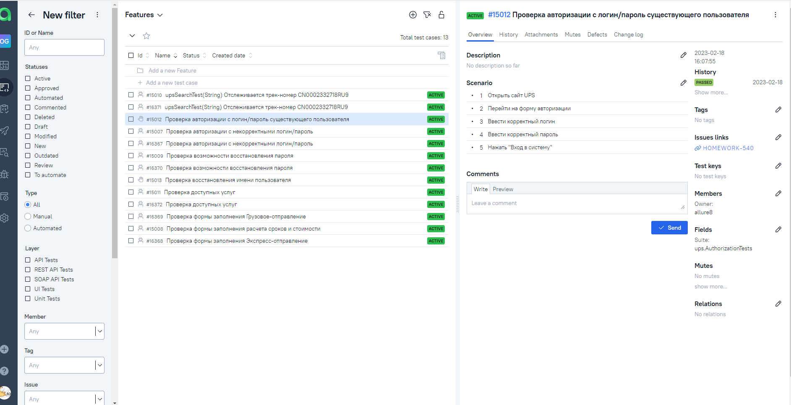
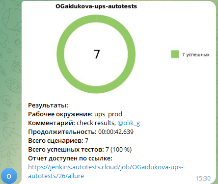

<h1 >Проект автоматизации UI для сайта <a href="https://www.web.com/ru/ru/Home.page">UPS.com</a></h1>

## :pushpin: Содержание:

* <a href="#tools">Технологии и инструменты</a>
* <a href="#cases">Реализованные проверки</a>
* <a href="#console">Запуск тестов из терминала</a>
* <a href="#jenkins">Запуск тестов в Jenkins</a>
* <a href="#allure">Отчеты в Allure</a>
* <a href="#testops">Интеграция с Allure TestOps</a>
* <a href="#testops">Интеграция с Jira</a>
* <a href="#telegram">Уведомления в Telegram с использованием бота</a>
* <a href="#video">Пример прогона теста в Selenoid</a>

<a id="tools"></a>
## :computer: Технологии и инструменты

<div align="center">
<a href="https://www.jetbrains.com/idea/"></a>
<a href="https://github.com/"></a>  
<a href="https://www.java.com/"></a>
<a href="https://gradle.org/"></a>  
<a href="https://junit.org/junit5/"></a>
<a href="https://selenide.org/"></a>
<a href="https://aerokube.com/selenoid/"></a>
<a href="https://www.jenkins.io/"></a>
<a href="https://github.com/allure-framework/"></a>
<a href="https://qameta.io/"></a>
<a href="https://www.atlassian.com/software/jira"></a>  
<a href="https://telegram.org/"></a>
</div>

Автотесты написаны на <code>Java</code> с использованием <code>JUnit 5</code> и <code>Gradle</code>.
Для UI-тестов использован фреймворк [Selenide](https://selenide.org/).
Запуск тестов можно осуществлять локально или с помощью [Selenoid](https://aerokube.com/selenoid/).
Также реализована сборка в <code>Jenkins</code> с формированием Allure-отчета и отправкой уведомления с результатами в <code>Telegram</code> после завершения прогона.

Allure-отчет включает в себя:
* шаги выполнения тестов;
* скриншот страницы в браузере в момент окончания автотеста;
* Page source;
* логи браузерной консоли;
* видео выполнения автотеста.

<a id="cases"></a>
## Реализованные проверки

### Автоматизированные проверки
✓ Проверка авторизации с некорректным логин/пароль

✓ Проверка расчета сроков и стоимости доставки

✓ Проверка возможности восстановления пароля

✓ Проверка заполнения формы регистрации

✓ Проверка отслеживания трек-номера

✓ Проверка доступных услуг

### Ручные проверки
✓ Проверка авторизации с логин/пароль существующего пользователя

✓ Проверка восстановления имени пользователя


<a id="console"></a>
## :running_woman: Запуск тестов из терминала
### Локальный запуск тестов

```
gradle clean test 
```

### Удаленный запуск тестов

```
clean test \
  -Dbrowser=${BROWSER} \
  -DbrowserVersion=${BROWSER_VERSION} \
  -DbrowserSize=${BROWSER_SIZE} \
  -Dremote=${REMOTE}
```

> `${BROWSER}` - наименование браузера (_по умолчанию - <code>chrome</code>_).
>
> `${BROWSER_VERSION}` - номер версии браузера (_по умолчанию - <code>100.0</code>_).
>
> `${BROWSER_SIZE}` - размер окна браузера (_по умолчанию - <code>1920x1080</code>_).
>
> `${REMOTE}` - адрес удаленного сервера, на котором будут запускаться тесты.

<a id="jenkins"></a>
##  Запуск тестов в <a target="_blank" href="https://jenkins.autotests.cloud/job/OGaidukova-ups-autotests/"> Jenkins </a>

> Сборка с параметрами позволяет перед запуском выбрать параметры для сборки.

<p align="center">
</a>
</p>

<a id="allure"></a>
##  Отчеты в <a target="_blank" href="https://jenkins.autotests.cloud/job/OGaidukova-ups-autotests/9/allure/"> Allure report </a>

### Основное окно

<p align="center">

</p>

### Тесты

<p align="center">

</p>

### Графики

<p align="center">

</p>

<a id="testops"></a>
##  Интеграция с <a target="_blank" href="https://allure.autotests.cloud/project/1889/test-cases?treeId=3631"> Allure TestOps </a>

### Доска
<p align="center">

</p>

### Тест-кейсы
<p align="center">

</p>

### Пример мануального тест-кейса
<p align="center">

</p>


<a id="jira"></a>
##  Интеграция с <a target="_blank" href="https://jira.autotests.cloud/browse/HOMEWORK-540"> Jira </a>
<p align="center">

</p>

<a id="telegram"></a>
##  Уведомления в Telegram с использованием бота

<p>

</p>

<a id="video"></a>
##  Пример прогона теста в Selenoid

> К каждому тесту в отчете прилагается видео
<p align="center">
  
</p>